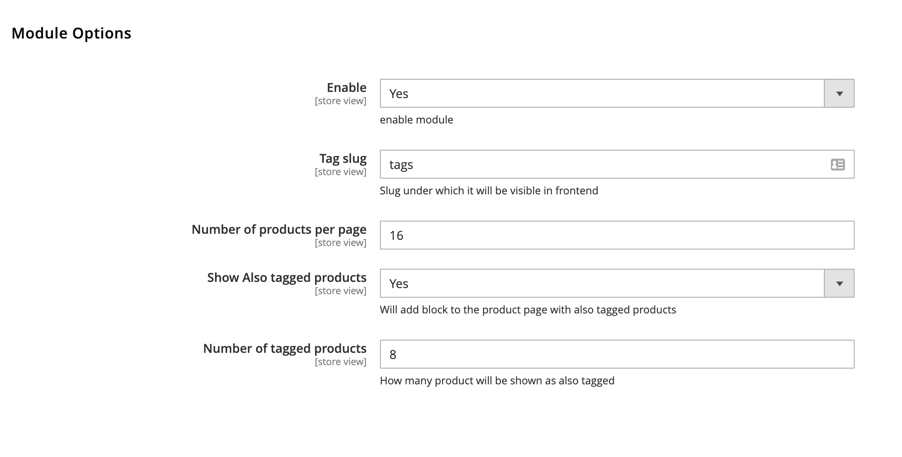
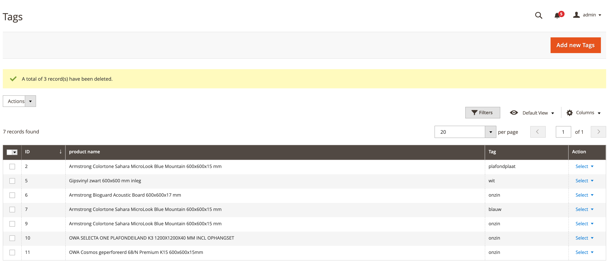
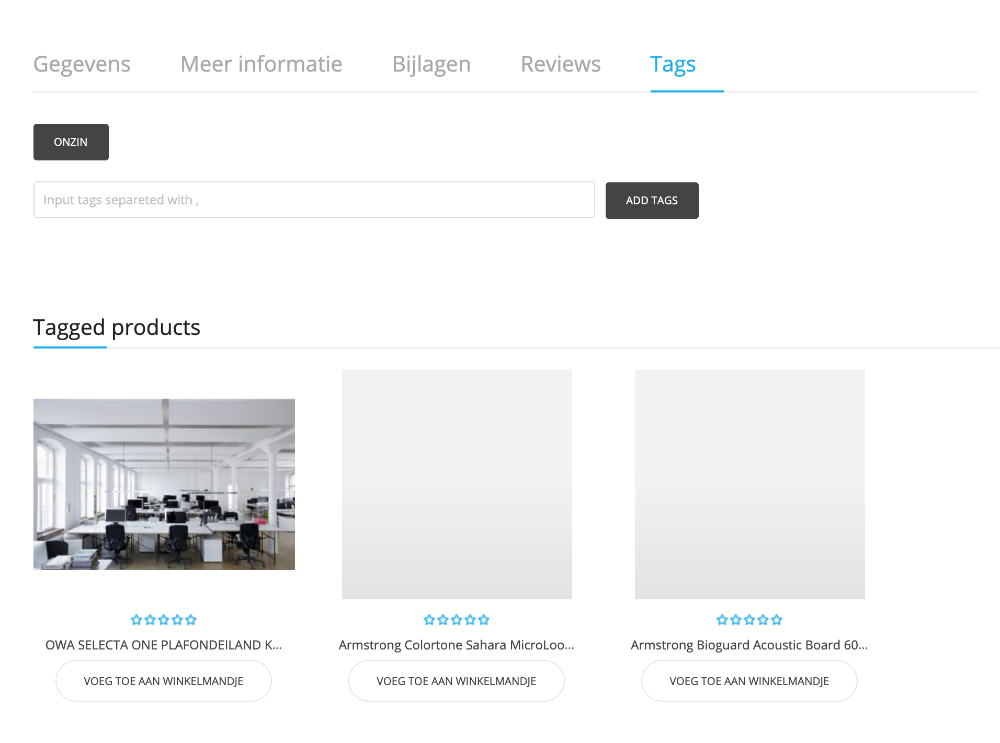
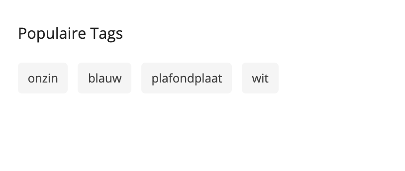
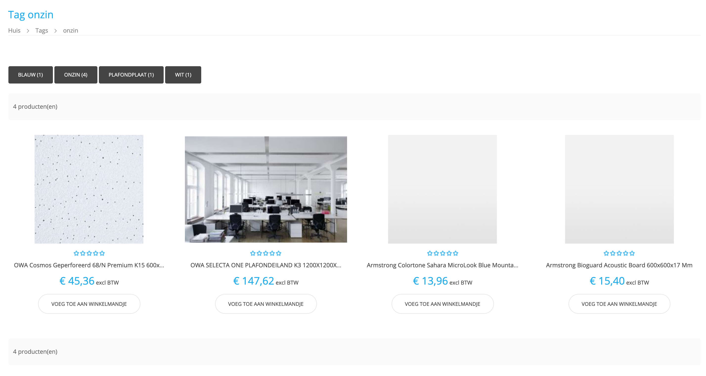

# Magento 2 module product tags

This Module adds tags functionality to Magento 2.

Frontend users can tag a product, tags can be viewed on a tag page ( slug is defined in backend ). Display Tagged product as related products on a productpage. Add widget with tags to any page / block.

Admin can delete tags which are not suited mass action supported.

System config :

Backend: 

Frontend : 

To install module simply download it and put contents of the app/code to the magento app/code Directory or you can try to download it with composer: wemessage/module-producttags ( not tested )

in console run following: bin/magento module:enable Wemessage_ProductTags

then run bin/magento setup:upgrade

To add widget use following code or choose it from the widgets:
{{widget type="Wemessage\ProductTags\Block\Widget\Tags" widgettitle="Popular Tags" limit="12" type_name="Product tags widget"}}

This plugin might not have same look and feel in your theme, but for most parts it uses magento theme class names.