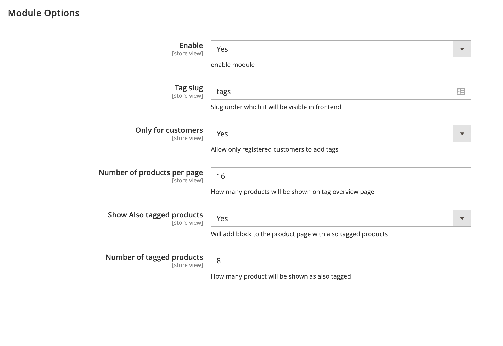

# Magento 2 module product tags

This Module adds tags functionality to Magento 2.

Frontend users can tag a product, tags can be viewed on a tag page ( slug is defined in backend ). Display Tagged product as related products on a productpage. Add widget with tags to any page / block.

Admin can delete tags which are not suited mass action supported.

System config :

Backend: 

Frontend : 

To install module simply download it and put contents of the app/code to the magento app/code Directory
